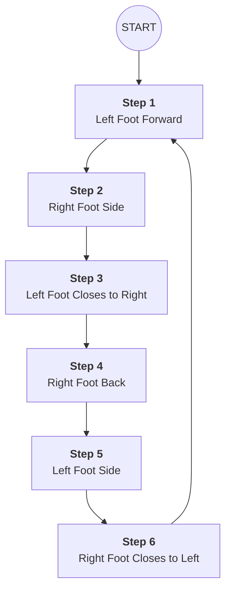

### **Project Guide: Week 1 Installation – The Solo Waltz Box**

This document serves as a technical reference for the "Day 1" installation on the Cygnet Boardwalk. The objective is to establish a "low-stakes" physical prompt that invites walkers to shift from a **Sympathetic** (rushed) to a **Parasympathetic** (contemplative) state through rhythmic movement.

---

#### **1. The Layout Logic (Waltz Box)**
The Waltz is a 3/4 time signature. The box step is a closed loop, meaning the participant ends exactly where they began. This is ideal for a boardwalk environment as it does not require the user to travel away from their belongings or a specific "gallery" zone.

**Technical Dimensions:**
* **Step Length/Width:** ~50cm (standard comfortable reach for older adults).
* **Shoeprint Size:** ~28cm–30cm (utilize the full A4 diagonal for your template).
* **Total Footprint:** Approximately 60cm x 60cm total area.

---

#### **2. Visual Flow & Step Order**

---

#### **3. Installation Map**
Refer to this grid when placing your wooden template. Imagine a square drawn on the boardwalk planks.

| Position | Foot | Step # | Orientation |
| :--- | :--- | :--- | :--- |
| **Front Left** | Left | **1** | Toes pointing forward |
| **Front Right** | Right | **2** | Toes pointing forward |
| **Front Right** | Left | **3** | Toes pointing forward (beside #2) |
| **Back Right** | Right | **4** | Toes pointing forward |
| **Back Left** | Left | **5** | Toes pointing forward |
| **Back Left** | Right | **6** | Toes pointing forward (beside #5) |

---

#### **4. Drawing Instructions (The "Peter Shanks" Method)**

1.  **Baseline Orientation:** Find a section of the boardwalk with consistent planking. Use the parallel lines of the wood to keep your "box" square.
2.  **The Trace:** * Lay the template flat. 
    * Use the **Right Foot** template for steps 2, 4, and 6.
    * **Flip** the template over for steps 1, 3, and 5 (the "Left Foot").
3.  **The Fill:** Use solid, high-contrast white chalk for the outline. If using color (Week 2), fill the heel with a secondary tone to help the walker orient their foot.
4.  **Numbering:** Place a small, clear circled number `(1)` through `(6)` near the arch of each footstep.
5.  **Safety Border:** If the boardwalk is damp, ensure the chalk is applied "dry" and rubbed into the grain. Avoid creating a thick, waxy "cake" of chalk which could reduce traction on the timber (Section 6.1).

---

#### **5. Strategic Signage Placement**
* **The "Start" Mark:** Chalk a simple "Start Here" arrow pointing to Step 1.
* **The "Why" (Optional):** Near Step 6, add a small chalk-written note: *"One-Two-Three... and repeat."*
* **The Data Point:** Ensure the sequence is placed between your two **Raspberry Pi Pico W** IR sensors (Section 3) to ensure you capture the full "Dwell Time" as they learn the pattern.

---

### **Citations for Portfolio**
* **Fancourt, D., & Finn, S. (2019).** *What is the evidence on the role of the arts in improving health and well-being?* World Health Organization. (Regarding the neuro-motor benefits of dance).
* **Daykin, N. (2020).** *Arts, Health and Well-Being: A Critical Perspective on Research, Policy and Practice.* (Regarding the "lowest possible door" for participation).